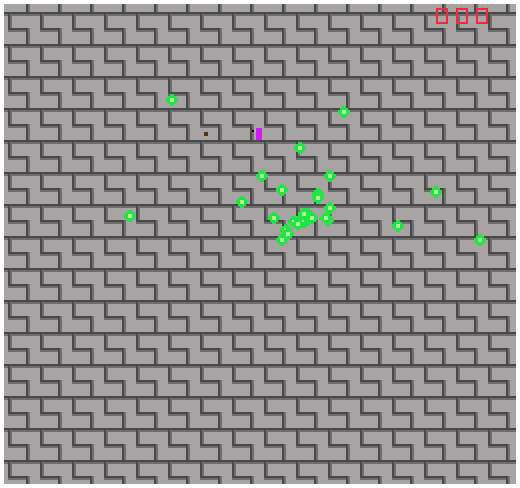

# Slime Super Shooter

Author: Kyle Jannak-Huang

Design: Slime Super Shooter is a simple 2D shooter/survival game, partially inspired by Black Ops Zombies, in which the player depends on proper wave management and slick movement in order to survive as long as possible.
This game is fresh in two ways: the player can only shoot in the direction it is facing/moving, forcing a tradeoff between running away and fighting. 
But if the player doesn't fight back enough, the enemies will get a dangerous speed boost.

Screen Shot:

How Your Asset Pipeline Works:

I drew all the assets for this game with GIMP. They were exported as PNGs, and by running build_assets.exe (main function in process_assets.cpp),
they are converted to palette and tile format and saved to a binary file. The colors for the palette are extracted from the image first, and then
each bit in the image is assigned an index into the palette vector. If the colors of the image are already known (i.e. extracted from an earlier sprite),
then the palette can be passed in to save the tile format only.

The binary file is read once openGL is initialized, and written to the tile table and palette table in the PPU.

How To Play:

Move using the arrow keys. You move faster diagonally (feaeture, not a bug). The slimes will move towards you, and if they touch you the game is reset.

Reap as many slimes as you can by shooting them. Shots are fired automatically in the direction you are facing. Your score is displayed in the top right.

If too many slimes are allowed to spawn at once, they will turn blue and get much faster. Try not to let this happen.

Sources: 

Some code was based off of the following sources.

http://www.cplusplus.com/reference/istream/istream/istream/
http://www.cplusplus.com/reference/ostream/ostream/ostream/

https://15466.courses.cs.cmu.edu/lesson/assets

This game was built with [NEST](NEST.md).

